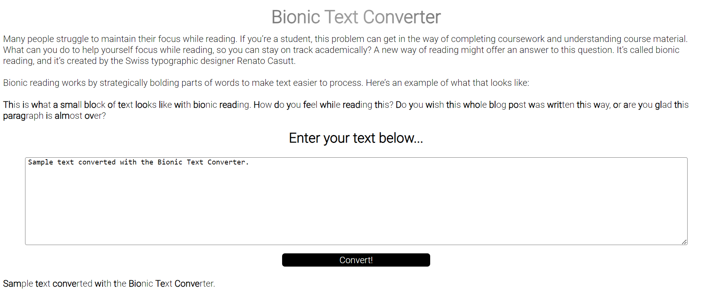

# bionic-text-converter

> A text converter that takes regular text and converts it into the bionic format for ease of reading.

## Table of contents

- [General info](#general-info)
- [Screenshots](#screenshots)
- [Technologies](#technologies)
- [Setup](#setup)
- [Live Application](#live-application)
- [Features](#features)
- [Status](#status)
- [Inspiration](#inspiration)
- [Contact](#contact)

## General info

Many people struggle to maintain their focus while reading. If you’re a student, this problem can get in the way of completing coursework and understanding course material. What can you do to help yourself focus while reading, so you can stay on track academically? A new way of reading might offer an answer to this question. It’s called bionic reading, and it’s created by the Swiss typographic designer Renato Casutt.

Bionic reading works by strategically bolding parts of words to make text easier to process.

## Screenshots

## Technologies

- HTML
- CSS
- JavaScript

## Setup

Open the index.html in any modern browser.

## Live Application

https://sbillsborough.github.io/bionic-text-converter/

## Features

List of features ready and TODOs for future development

- Awesome feature 1
- Awesome feature 2
- Awesome feature 3

To-do list:

- Wow improvement to be done 1
- Wow improvement to be done 2

## Status

Project is: _in progress_, _finished_, _no longer continue_ and why?

## Inspiration

Add here credits. Project inspired by..., based on...

## Contact

Created by [@flynerdpl](https://www.flynerd.pl/) - feel free to contact me!
